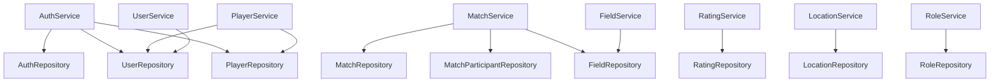
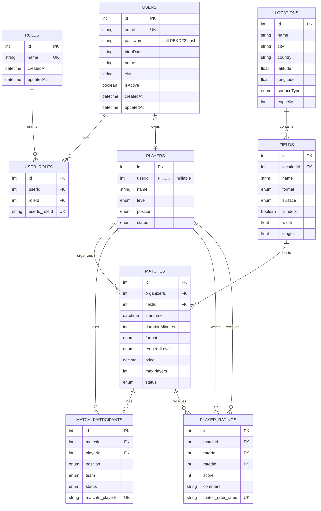
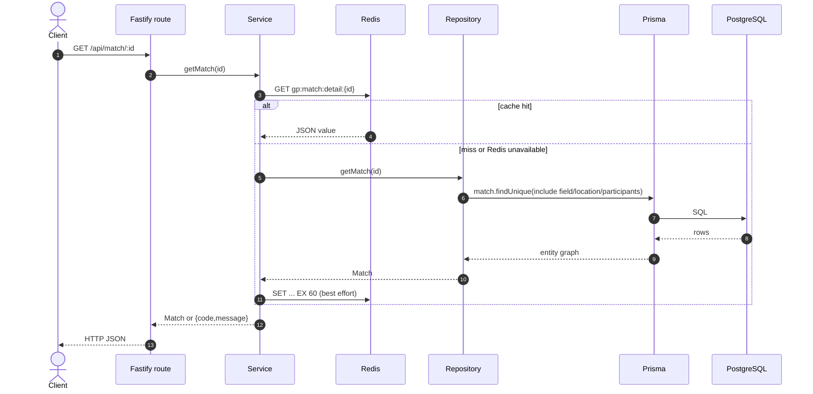
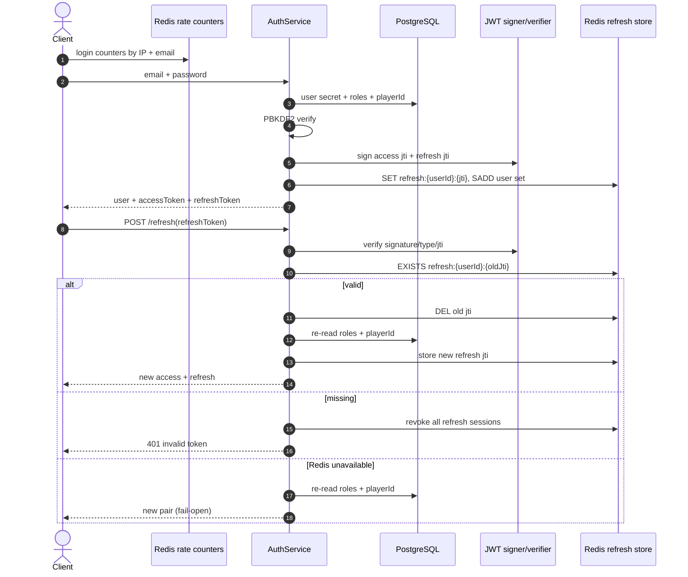
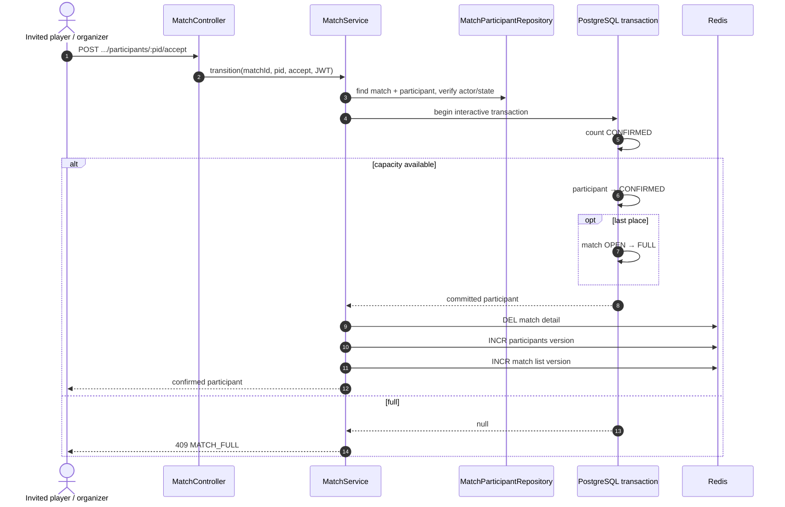
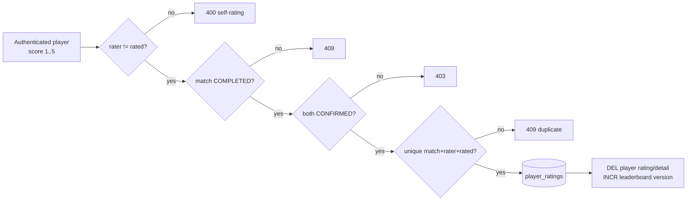
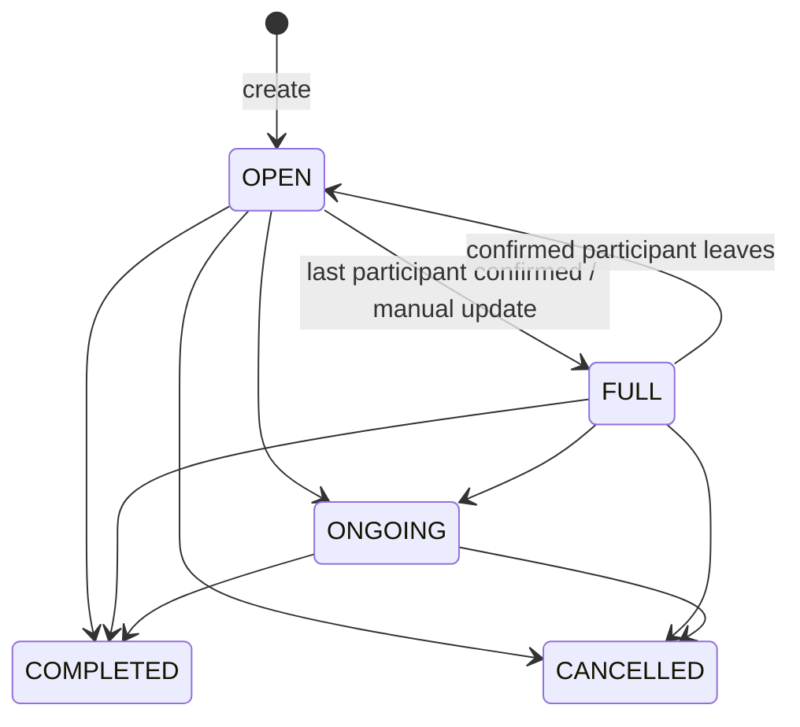
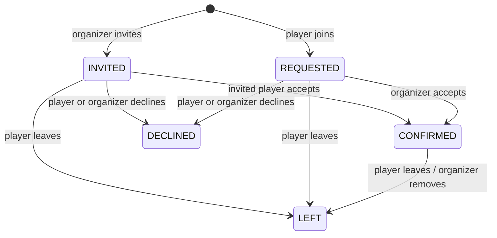
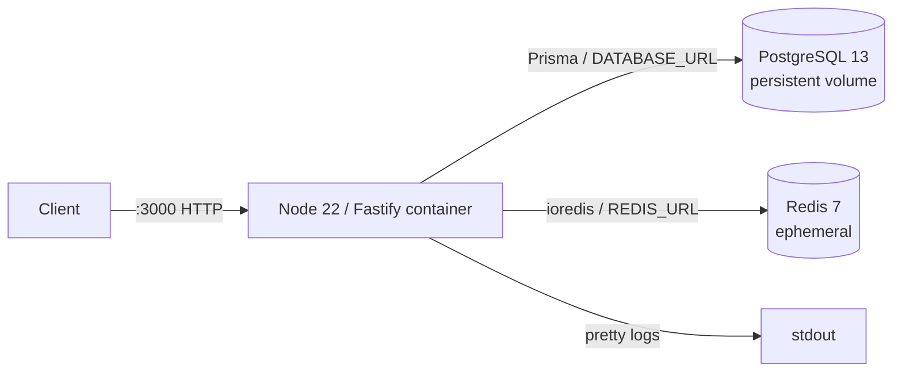
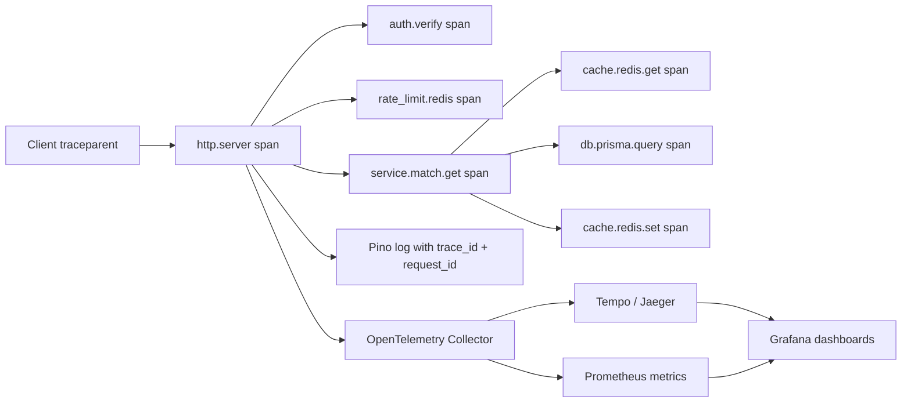

# Gonna Play Backend — дашборд фактической архитектуры

> Срез репозитория на 2026-07-20. Этот документ описывает **реально подключённый код**, а не целевую архитектуру из старой wiki. Источники правды: `src/router.ts`, `src/**/*.routes.ts`, `src/**/*.controller.ts`, `src/**/*.service.ts`, `src/**/*.repository.ts`, `prisma/schema.prisma`, `src/utils/cache.ts` и Docker Compose-файлы.

## Паспорт системы

| Показатель | Фактическое состояние |
|---|---|
| Runtime | Node.js 22, TypeScript, ESM |
| HTTP | Fastify 5, TypeBox-схемы |
| Доменные модули | 8: auth, user, player, location, field, match, rating, role |
| Маршруты | 44 доменных + `/ping` + `/docs/json` |
| Основная БД | PostgreSQL 13 через Prisma 6 |
| Таблицы | 9: `roles`, `users`, `user_roles`, `players`, `locations`, `fields`, `matches`, `match_participants`, `player_ratings` |
| Redis | cache-aside, refresh-сессии, access blacklist, rate limiting |
| Авторизация | JWT access/refresh + RBAC по именам ролей |
| API-спецификация | OpenAPI 3.0.3 на `GET /docs/json` |
| Наблюдаемость | Fastify/Pino request logs; distributed tracing и метрики не реализованы |
| Деплой | Один backend-контейнер + PostgreSQL + Redis в dev/prod Compose |

## 1. Системная карта

```mermaid
flowchart LR
    client[Mobile / Web / Postman] -->|HTTP JSON\nBearer access JWT| fastify

    subgraph api[Fastify process]
      direction TB
      fastify[HTTP router]
      cross[CORS → route schema → rate limit → authenticate → authorize]
      modules[auth · user · player · location\nfield · match · rating · role]
      ctrl[Controllers\nHTTP → service arguments]
      svc[Services\nbusiness rules + orchestration]
      repo[Repositories\nPrisma queries]
      errors[preSerialization\n{code,message} → HTTP status]
      docs[Swagger generator\nGET /docs/json]
      logs[Pino / Fastify logs]

      fastify --> cross --> modules --> ctrl --> svc --> repo
      svc --> errors
      fastify --> docs
      fastify --> logs
    end

    repo --> prisma[Prisma singleton\nsrc/config/prisma.ts]
    prisma --> pg[(PostgreSQL\nsource of truth)]
    svc <-->|GET/SET/DEL/INCR\nfail-open| redis[(Redis)]
    cross <-->|refresh state\nblacklist · counters| redis

    pluginPrisma[server.prisma\nsecond PrismaClient] -. decorated but not used\nby controllers .-> api
```

Основной запрос проходит так:

`клиент → Fastify route/preHandlers → controller → service → repository → Prisma → PostgreSQL → response`.

Для кешируемых чтений service сначала обращается в Redis. На cache miss вызывается repository, успешный результат кладётся в Redis с TTL. Любая ошибка Redis проглатывается: запрос продолжает работу через PostgreSQL.

### Порядок подключения сквозных компонентов

```mermaid
flowchart LR
    boot[src/index.ts] --> cors[CORS]
    cors --> prismaPlugin[Prisma plugin]
    prismaPlugin --> redisPlugin[Redis plugin]
    redisPlugin --> jwt[JWT authenticate / authorize]
    jwt --> swagger[Swagger]
    swagger --> errorHook[preSerialization error hook]
    errorHook --> routes[Domain routes]
    routes --> ping[/ping]
```

`@fastify/helmet` установлен как dependency, но в `src/index.ts` не зарегистрирован.

## 2. Карта модулей и зависимостей

| Модуль | Controller → Service | Репозитории | Таблицы | Redis |
|---|---|---|---|---|
| auth | `AuthController → AuthService` | Auth, User, Player | users, user_roles, roles, players | refresh JTI, optional access blacklist, login/register/refresh limits |
| user | `UserController → UserService` | User | users | нет прикладного кеша |
| player | `PlayerController → PlayerService` | Player, User | players, users, player_ratings | list/detail cache |
| location | `LocationController → LocationService` | Location | locations, fields | list/detail cache |
| field | `FieldController → FieldService` | Field | fields, locations | list/detail cache; инвалидирует location detail |
| match | `MatchController → MatchService` | Match, MatchParticipant, Field | matches, match_participants, fields, locations, players | list/detail/participants cache |
| rating | `RatingController → RatingService` | Rating | player_ratings, matches, match_participants | player rating/detail cache |
| role | `RoleController → RoleService` | Role | roles, user_roles, users | нет прикладного кеша |

Контроллеры создают repository/service вручную в constructor. DI-контейнера нет. Межмодульные зависимости сосредоточены в `auth`, `player` и `match`.



## 3. API dashboard

Базовый адрес по умолчанию: `http://localhost:3000`. Защищённые методы ожидают заголовок `Authorization: Bearer <accessToken>`. Пагинация списков: `page`, `limit` (максимум 100), `sort`, `order=asc|desc`.

Легенда доступа:

- **public** — токен не нужен;
- **auth** — валидный access JWT;
- **owner** — текущий пользователь/игрок либо admin;
- **organizer** — организатор матча либо admin;
- **admin** — JWT должен содержать роль `admin`.

### Auth

| Метод и путь | Доступ | Назначение / вход | Ограничение |
|---|---|---|---|
| `POST /api/auth/register` | public | `email`, `password`, `birthDate`; опционально профиль и `createPlayer` | 5 запросов / час / IP |
| `POST /api/auth/login` | public | `email`, `password` → user + access/refresh JWT | 10 / 15 мин / IP и отдельно / email |
| `POST /api/auth/refresh` | public | `refreshToken` → ротация пары токенов | 30 / 15 мин / IP |
| `GET /api/auth/me` | auth | Текущий user и связанный `playerId` | — |
| `POST /api/auth/logout` | auth | Удаляет все refresh-сессии пользователя; опционально blacklist access JWT | — |

### Users и Players

| Метод и путь | Доступ | Назначение / фильтры |
|---|---|---|
| `GET /api/user/list` | admin | Пользователи; `city`, `isActive` + пагинация |
| `GET /api/user/:id` | owner | Получить учётную запись |
| `PUT /api/user/:id` | owner | Обновить учётную запись |
| `DELETE /api/user/:id` | admin | Удалить user; каскадно роли, player получает `userId=null` |
| `GET /api/player/list` | auth | Игроки; `level`, `position`, `status`, `search` + пагинация |
| `GET /api/player/:id` | auth | Игрок + user + вычисленный average/count рейтинга |
| `POST /api/player` | auth | Создать игровой профиль; по умолчанию привязать к caller user |
| `PUT /api/player/:id` | owner | Обновить профиль игрока |
| `DELETE /api/player/:id` | admin | Удалить профиль игрока |

### Locations и Fields

| Метод и путь | Доступ | Назначение / фильтры | Ограничение |
|---|---|---|---|
| `GET /api/location/list` | public | `city`, `country`, `search` + пагинация | 120 / мин / IP |
| `GET /api/location/:id` | public | Локация вместе с полями | — |
| `POST /api/location` | admin | Создать локацию | — |
| `PUT /api/location/:id` | admin | Обновить локацию | — |
| `DELETE /api/location/:id` | admin | Удалить; запрещено, если цепочка содержит матчи | — |
| `GET /api/field/list` | public | `locationId`, `format`, `surface`, `isIndoor` + пагинация | 120 / мин / IP |
| `GET /api/field/:id` | public | Поле вместе с локацией | — |
| `POST /api/field` | admin | Создать поле в существующей локации | — |
| `PUT /api/field/:id` | admin | Обновить поле; `locationId` и `format` не меняются | — |
| `DELETE /api/field/:id` | admin | Удалить; FK запрещает удаление поля с матчами | — |

### Matches и participation

| Метод и путь | Доступ | Назначение / правило | Ограничение |
|---|---|---|---|
| `GET /api/match/list` | public | `city`, `dateFrom`, `dateTo`, `format`, `level`, `status`, `fieldId`, `organizerId` | 60 / мин / IP |
| `GET /api/match/:id` | public | Матч + field/location + participants/player | — |
| `POST /api/match` | auth + player | Создать матч; формат обязан совпадать с форматом поля | — |
| `PUT /api/match/:id` | organizer | Изменить время, длительность, уровень, цену, лимит, статус | — |
| `DELETE /api/match/:id` | organizer | Soft-cancel: статус `CANCELLED`, история остаётся | — |
| `GET /api/match/:id/participants` | public | Участники; опционально `status` | — |
| `POST /api/match/:id/invite` | organizer | Пригласить `playerId`; статус `INVITED` | — |
| `POST /api/match/:id/join` | auth + player | Подать заявку; статус `REQUESTED` | — |
| `POST /api/match/:id/participants/:pid/accept` | state-dependent | INVITED принимает сам игрок; REQUESTED принимает organizer/admin | — |
| `POST /api/match/:id/participants/:pid/decline` | state-dependent | Отказ приглашённого/заявителя либо удаление organizer/admin | — |
| `POST /api/match/:id/leave` | auth + player | Уйти из матча; статус `LEFT`, FULL может открыться | — |

### Ratings и Roles

| Метод и путь | Доступ | Назначение / правило |
|---|---|---|
| `POST /api/rating` | auth + player | Оценка 1–5 после COMPLETED; оба игрока должны быть CONFIRMED; self-rating запрещён |
| `GET /api/rating/player/:playerId` | public | Средняя оценка, количество и список оценок игрока |
| `GET /api/rating/match/:matchId` | participant/admin | Все оценки матча |
| `DELETE /api/rating/:id` | author/admin | Удалить свою оценку |
| `GET /api/role/list` | admin | Список ролей |
| `POST /api/role` | admin | Создать уникальную роль |
| `DELETE /api/role/:id` | admin | Удалить роль и её назначения |
| `POST /api/role/assign` | admin | Назначить `{userId, roleId}` |
| `POST /api/role/revoke` | admin | Отозвать `{userId, roleId}` |

### Служебные маршруты

| Метод и путь | Доступ | Назначение |
|---|---|---|
| `GET /ping` | public | Простая проверка процесса: `{message: "pong"}` |
| `GET /docs/json` | public | OpenAPI 3.0.3, собранный из route schemas |

## 4. Таблицы и связи



### Кардинальности и удаление

| Родитель → ребёнок | Связь | Поведение при удалении |
|---|---|---|
| users → user_roles | 1:N | `CASCADE` |
| roles → user_roles | 1:N | `CASCADE` |
| users → players | 1:0..1 | `SET NULL` у player |
| locations → fields | 1:N | `CASCADE`, но матчи ниже могут заблокировать цепочку |
| players → matches (organizer) | 1:N | `CASCADE` |
| fields → matches | 1:N | `RESTRICT` |
| matches → match_participants | 1:N | `CASCADE` |
| players → match_participants | 1:N | `CASCADE` |
| matches → player_ratings | 1:N | `CASCADE` |
| players → player_ratings (rater/rated) | 1:N | `CASCADE` |

### Уникальности и важные индексы

- `users.email`, `roles.name`, `players.userId` — unique.
- `user_roles(userId, roleId)` — одна роль назначается пользователю один раз.
- `match_participants(matchId, playerId)` — одна запись игрока на матч.
- `player_ratings(matchId, raterId, ratedId)` — одна оценка конкретного игрока конкретным автором за матч.
- Списки матчей поддержаны индексами по `organizerId`, `fieldId`, `status`, `format`, `requiredLevel`, `startTime` и составным `(status, startTime)`.
- Для участников есть индексы `playerId` и `(matchId, status)`; для рейтингов — `ratedId`, `raterId`, `matchId`.

### Доменные enum

| Enum | Значения |
|---|---|
| PLAYER_LEVEL | JUNIOR, MIDDLE, SENIOR, LEGEND |
| PLAYER_POSITION | GOALKEEPER, DEFENDER, MIDFIELDER, FORWARD |
| PLAYER_STATUS | ACTIVE, INACTIVE |
| MATCH_FORMAT | FIVE_V_FIVE, SEVEN_V_SEVEN, ELEVEN_V_ELEVEN |
| MATCH_STATUS | OPEN, FULL, ONGOING, COMPLETED, CANCELLED |
| PARTICIPANT_STATUS | INVITED, REQUESTED, CONFIRMED, DECLINED, LEFT |
| MATCH_TEAM | TEAM_A, TEAM_B |
| SURFACE_TYPE | NATURAL_GRASS, ARTIFICIAL_GRASS, FUTSAL, CONCRETE, DIRT |

## 5. Runtime tracing: ключевые потоки

### Кешируемое чтение



### Login и refresh rotation



### Подтверждение участника и заполнение матча



Транзакция не задаёт `isolationLevel: Serializable` и не берёт явную блокировку строки матча. Поэтому заявленная в комментариях защита от двух параллельных accept требует отдельного concurrency-теста: при стандартном PostgreSQL `READ COMMITTED` один только `count` внутри interactive transaction не является полной гарантией от overbooking.

### Оценка игрока



## 6. State machines

### Матч



`PUT /match/:id` применяет таблицу разрешённых переходов. `DELETE /match/:id` напрямую ставит `CANCELLED` и отдельно не запрещает отмену уже завершённого матча.

### Участник матча



## 7. Cache dashboard

Все физические Redis-ключи автоматически получают prefix `gp:`. При недоступности Redis кеш, rate limits и stateful auth-проверки работают в режиме **fail-open**.

### Read-through cache

| Класс | Физический шаблон после `gp:` | TTL | Читатель | Инвалидация |
|---|---|---:|---|---|
| match list | `match:list:g{version}:{filterHash}` | 30 c | `GET /match/list` | create/update/cancel; accept/decline/leave |
| match detail | `match:detail:{id}` | 60 c | `GET /match/:id` | update/cancel; любая participation mutation |
| participants | `match:participants:{matchId}:g{version}:{hash}` | 30 c | `GET /match/:id/participants` | invite/join/accept/decline/leave |
| field list | `field:list:g{version}:{hash}` | 300 c | `GET /field/list` | field create/update/delete |
| field detail | `field:detail:{id}` | 300 c | `GET /field/:id` | field update/delete |
| location list | `location:list:g{version}:{hash}` | 600 c | `GET /location/list` | location create/update/delete |
| location detail | `location:detail:{id}` | 600 c | `GET /location/:id` | location update/delete; field create/update/delete |
| player list | `player:list:g{version}:{hash}` | 60 c | `GET /player/list` | player create/update/delete |
| player detail | `player:detail:{id}` | 120 c | `GET /player/:id` | player update/delete; rating create/delete |
| player rating | `player:rating:{playerId}` | 300 c | `GET /rating/player/:id` | rating create/delete |
| field schedule | version `ver:field:schedule:{fieldId}` | 60 c declared | **читателя/значений пока нет** | match create/update/cancel bump version |
| leaderboard | version `ver:player:leaderboard` | 300 c declared | **endpoint/значений пока нет** | rating create/delete bump version |

Версионированная инвалидация не удаляет старые list keys: `INCR ver:<class>` мгновенно переключает читателей на новое поколение, а старое поколение исчезает по TTL. Filter hash — первые 16 hex-символов SHA-1 от канонической строки фильтров.

### Auth state и rate limits

| Назначение | Ключ после `gp:` | TTL / поведение |
|---|---|---|
| Активный refresh | `auth:refresh:{userId}:{jti}` | `REFRESH_TOKEN_TTL`, default 30 дней |
| Индекс сессий user | `auth:refresh:user:{userId}` (Set) | default 30 дней; logout удаляет все JTI |
| Access blacklist | `auth:blacklist:{jti}` | оставшееся время access JWT; выключено по умолчанию |
| Rate limit | `rate:{action}:{ip-or-email}` | fixed window конкретного route |

Сбой Redis имеет разные последствия:

- data cache превращается в прямое чтение PostgreSQL;
- rate limits перестают ограничивать запросы;
- access blacklist не применяется;
- login/register продолжают выдавать токены;
- refresh продолжает ротацию без проверки server-side JTI.

## 8. Инфраструктура и системный дизайн



| Среда | Backend | PostgreSQL | Redis | Особенности |
|---|---:|---:|---:|---|
| `docker-compose.dev.yml` | да | да | да | bind mount, watch mode, `HOST=0.0.0.0` |
| `docker-compose.prod.yml` | да | да | да | JWT secret обязателен, Redis без volume |
| `docker-compose.yml` | да | да | нет | `HOST` не задан и Redis default указывает на localhost контейнера |
| `docker-compose.test.yml` | да | да | нет | cache/auth/rate-limit Redis paths работают fail-open |

Сейчас не реализованы: load balancer/reverse proxy, несколько backend replicas, worker/queue, scheduler/cron, object storage/CDN, Telegram integration и managed observability stack. Они упоминаются в старой wiki как целевые элементы, но отсутствуют в runtime-коде.

## 9. Observability и tracing dashboard

### Что есть сейчас

| Сигнал | Реализация | Ограничение |
|---|---|---|
| Logs | Fastify + Pino, `pino-pretty`, стандартный request lifecycle | нет централизованного хранилища, JSON production profile и доменной корреляции |
| Request ID | Fastify создаёт id запроса в своём логгере | id явно не прокидывается в service/repository и внешние зависимости |
| Liveness | `GET /ping` | не проверяет PostgreSQL/Redis, readiness endpoint отсутствует |
| Errors | exact `{code,message}` повышается до соответствующего HTTP status | нет error dashboard/alerting |
| API contract | OpenAPI JSON | Swagger UI не подключён; схемы есть не у всех responses/security |
| Distributed traces | отсутствуют | нет OpenTelemetry SDK, spans, exporter, collector, Jaeger/Tempo |
| Metrics | отсутствуют | нет latency/error/cache/DB pool/business metrics |

### Рекомендуемая трасса одного запроса (целевая, не реализована)



Минимальный будущий набор панелей:

1. HTTP: RPS, p50/p95/p99 latency, 4xx/5xx по route.
2. PostgreSQL: query latency, pool saturation, transaction errors.
3. Redis: hit/miss по cache class, command latency, errors, evictions.
4. Auth: login failures, refresh reuse, blacklist hits, rate-limit rejects.
5. Match domain: created/joined/confirmed/cancelled, capacity conflicts.
6. Trace search: `trace_id`, `request_id`, `user.id`, route, match.id без секретов/JWT.

## 10. Найденные расхождения и риски

| Приоритет | Наблюдение | Практический эффект |
|---|---|---|
| высокий | Миграция `20260712173703_add_match_domain` помечена как ручной черновик и «не применялась» | Код ожидает 5 новых таблиц; состояние реальной БД нужно проверять отдельно |
| высокий | Confirm capacity использует transaction без explicit Serializable/lock | Возможен concurrency race; нужен параллельный интеграционный тест |
| высокий | Redis security paths fail-open | При outage отключаются rate limit, refresh-state validation и blacklist |
| средний | Создаются два PrismaClient: plugin и singleton; контроллеры используют singleton | `server.prisma` фактически не участвует в запросах, а onClose закрывает другой client |
| средний | Distributed tracing, metrics и readiness отсутствуют | Нет end-to-end диагностики latency/errors и dependency health |
| средний | Base/test Compose не содержат Redis; base Compose также не задаёт `HOST=0.0.0.0` | Поведение и доступность отличаются от dev/prod |
| средний | `@fastify/helmet` установлен, но не зарегистрирован | Security headers, описанные в старой wiki, не выдаются приложением |
| средний | Player route schemas передаются не как `{body: ...}`, update schema требует `id` в body | Фактическая HTTP-валидация/контракт могут расходиться с намерением |
| средний | `updateUserSchema.avatar` — number, а Prisma/model — string | OpenAPI/runtime validation расходятся со схемой БД |
| низкий | `FIELD_SCHEDULE` и `PLAYER_LEADERBOARD` TTL/version classes не имеют читателей | Есть мёртвые/заготовленные cache invalidations |
| низкий | Старая `docs/wiki` описывает Redis как отсутствующий и перечисляет несуществующие cron/S3/Telegram/feature flags | Новые участники могут принять roadmap за реализованную систему |

## 11. Где смотреть код

| Область | Файлы |
|---|---|
| Bootstrap и router | `src/index.ts`, `src/server.ts`, `src/router.ts` |
| Сквозные плагины | `src/plugins/auth.ts`, `prisma.ts`, `redis.ts`, `swagger.ts` |
| Доменные слои | `src/<module>/*.routes.ts`, `*.controller.ts`, `*.service.ts`, `*.repository.ts`, `*.model.ts` |
| Cache/rate limit | `src/utils/cache.ts`, `src/utils/rateLimit.ts` |
| Refresh/blacklist | `src/auth/refreshStore.ts` |
| Data model | `prisma/schema.prisma`, `prisma/migrations/` |
| Runtime topology | `Dockerfile`, `docker-compose*.yml` |

## 12. Граница достоверности

Дашборд построен статическим анализом репозитория. Он показывает намерение текущего кода, но не подтверждает, что черновая миграция применена к конкретной БД, Redis доступен в конкретном окружении или маршруты успешно прошли интеграционные тесты. Для operational dashboard следующим шагом нужны реальные OpenTelemetry/metrics-инструментация и подключённый collector.
