# Gonna Play Backend — дашборд фактической архитектуры

> Срез репозитория на 2026-07-20. Этот документ описывает **реально подключённый код**, а не целевую архитектуру из старой wiki. Источники правды: `src/router.ts`, `src/**/*.routes.ts`, `src/**/*.controller.ts`, `src/**/*.service.ts`, `src/**/*.repository.ts`, `prisma/schema.prisma`, `src/utils/cache.ts` и Docker Compose-файлы.

> **Правки 2026-07-23.** По итогам сплошной сверки исправлены непомеченные устаревшие места вне матчевого раздела: имена полей `Match` в ER-диаграмме §4 и в сортировке §3 (`startsAt`/`durationMin`/`skillMin/Max`), состав `MATCH_PARTICIPANTS`, список индексов, риски §10 про compose-Redis, `fastify-jwt` и схемы роутов (сняты как опровергнутые). Модуль `rating` здесь показан как фактически существующий, но это отклонение от решения Р1 (к удалению). Матчевый ⛔-раздел ниже намеренно не трогали. Целевая модель и решения — в приведённой к коду [wiki](wiki/README.md).

> ## ⛔ НЕДОСТОВЕРНО: всё про матчи и участие
>
> **Не пишите по этому документу код и тесты матчевого домена.** Разделы «Matches и participation» (§3), матчевые строки таблицы enum-ов (§4), «Подтверждение участника и заполнение матча» (§5) и обе state machine (§6) описывают **инвайт-модель, которой в коде никогда не было**: приглашения, заявки, статусы `INVITED`/`REQUESTED`/`DECLINED`/`LEFT`, статусы матча `ONGOING`/`COMPLETED`, метод `resolveTransition`, эндпоинты `/invite` и `/participants/:pid/accept|decline`. Ничего из этого не существует. Прогон тестового покрытия из-за этого дважды переделывал работу с нуля.
>
> **Фактическая модель — лист ожидания, а не приглашения.** Статусы матча: `DRAFT`, `OPEN`, `FULL`, `CONFIRMED`, `IN_PROGRESS`, `FINISHED`, `CANCELLED`. Статусы участия: `REGISTERED`, `WAITLISTED`, `CONFIRMED`, `CHECKED_IN`, `NO_SHOW`, `CANCELLED`.
>
> **Источник истины по матчам — только код:** `src/constants/enums.ts` (enum-ы), `prisma/schema.prisma` (таблицы и связи), `src/match/` (маршруты, сервис, репозитории).
>
> Достоверны в матчевой части лишь четыре строки таблицы эндпоинтов — `GET /api/match/list`, `GET /api/match/:id`, `POST /api/match` и `GET /api/match/:id/participants`; остальное неверно.
>
> Разделы намеренно **не переписаны, а помечены**: переработка под фактическую модель отложена до стабилизации среза `src/match/*`, который сейчас правится параллельно.

## Паспорт системы

| Показатель | Фактическое состояние |
|---|---|
| Runtime | Node.js 24 (`engines.node >=22`), TypeScript, ESM |
| HTTP | Fastify 5, TypeBox-схемы |
| Доменные модули | 8: auth, user, player, location, field, match, rating, role |
| Маршруты | 44 доменных + `/ping` + `/docs/json` |
| Основная БД | PostgreSQL 13 через Prisma 6 |
| Таблицы | 9: `roles`, `users`, `user_roles`, `players`, `locations`, `fields`, `matches`, `match_participants`, `player_ratings` |
| Redis | cache-aside, refresh-сессии, access blacklist, rate limiting |
| Авторизация | JWT access/refresh + RBAC по именам ролей |
| API-спецификация | OpenAPI 3.0.3 на `GET /docs/json` |
| Наблюдаемость | Fastify/Pino request logs; distributed tracing и метрики не реализованы |
| Деплой | Один backend-контейнер + PostgreSQL + Redis в dev/prod Compose |

## 1. Системная карта

```mermaid
flowchart LR
    client[Mobile / Web / Postman] -->|HTTP JSON\nBearer access JWT| fastify

    subgraph api[Fastify process]
      direction TB
      fastify[HTTP router]
      cross[CORS → route schema → rate limit → authenticate → authorize]
      modules[auth · user · player · location\nfield · match · rating · role]
      ctrl[Controllers\nHTTP → service arguments]
      svc[Services\nbusiness rules + orchestration]
      repo[Repositories\nPrisma queries]
      errors[preSerialization\n{code,message} → HTTP status]
      docs[Swagger generator\nGET /docs/json]
      logs[Pino / Fastify logs]

      fastify --> cross --> modules --> ctrl --> svc --> repo
      svc --> errors
      fastify --> docs
      fastify --> logs
    end

    repo --> prisma[getPrisma\nслот модуля src/config/prisma.ts]
    prisma --> pg[(PostgreSQL\nsource of truth)]
    svc <-->|GET/SET/DEL/INCR\nfail-open| redis[(Redis)]
    cross <-->|refresh state\nblacklist · counters| redis

    pluginPrisma[server.prisma] -. тот же самый клиент,\nдекорирован плагином .-> prisma
```

Основной запрос проходит так:

`клиент → Fastify route/preHandlers → controller → service → repository → Prisma → PostgreSQL → response`.

Для кешируемых чтений service сначала обращается в Redis. На cache miss вызывается repository, успешный результат кладётся в Redis с TTL. Любая ошибка Redis проглатывается: запрос продолжает работу через PostgreSQL.

### Порядок подключения сквозных компонентов

```mermaid
flowchart LR
    boot[src/index.ts\nтолько listen] --> build[buildApp\nsrc/app.ts]
    build --> cors[CORS]
    cors --> prismaPlugin[Prisma plugin]
    prismaPlugin --> redisPlugin[Redis plugin]
    redisPlugin --> jwt[JWT authenticate / authorize]
    jwt --> swagger[Swagger]
    swagger --> errorHook[preSerialization error hook]
    errorHook --> routes[Domain routes]
    routes --> ping[/ping]
```

Сборка приложения вынесена в фабрику `buildApp()` (`src/app.ts`): она создаёт экземпляр Fastify, регистрирует плагины в порядке выше, вешает `preSerialization`-хук, подключает маршруты и возвращает уже готовый (`await server.ready()`) инстанс. `src/index.ts` только вызывает фабрику и слушает порт; отдельного `src/server.ts` больше нет — модуль удалён. Тесты получают собственный изолированный инстанс тем же вызовом `buildApp({ logger: { level: "silent" } })`.

**Клиенты БД и кеша больше не создаются на импорте.** `src/config/prisma.ts` и `src/config/redis.ts` держат приватный слот модуля и отдают клиент лениво — `getPrisma()` / `getRedis()` создают его при первом обращении, `closePrisma()` / `closeRedis()` закрывают и освобождают слот. Владельцы жизненного цикла — плагины: `src/plugins/prisma.ts` декорирует `server.prisma` тем же самым объектом, `src/plugins/redis.ts` передаёт свой в `@fastify/redis` с `closeClient: false`, и оба закрывают клиент в хуке `onClose`. Пул Prisma в процессе **один**: второго `PrismaClient` внутри плагина, как было раньше, больше нет, и репозитории работают ровно с тем клиентом, который декорирован на инстансе. `src/config/redis.ts` дополнительно экспортирует `setRedis()` — шов, через который юнит-тесты подставляют in-memory заглушку.

`@fastify/helmet` установлен как dependency, но в `buildApp()` не регистрируется.

## 2. Карта модулей и зависимостей

| Модуль | Controller → Service | Репозитории | Таблицы | Redis |
|---|---|---|---|---|
| auth | `AuthController → AuthService` | Auth, User, Player | users, user_roles, roles, players | refresh JTI, optional access blacklist, login/register/refresh limits |
| user | `UserController → UserService` | User | users | нет прикладного кеша |
| player | `PlayerController → PlayerService` | Player, User | players, users, player_ratings | list/detail cache |
| location | `LocationController → LocationService` | Location | locations, fields | list/detail cache |
| field | `FieldController → FieldService` | Field | fields, locations | list/detail cache; инвалидирует location detail |
| match | `MatchController → MatchService` | Match, MatchParticipant, Field | matches, match_participants, fields, locations, players | list/detail/participants cache |
| rating | `RatingController → RatingService` | Rating | player_ratings, matches, match_participants | player rating/detail cache |
| role | `RoleController → RoleService` | Role | roles, user_roles, users | нет прикладного кеша |

Контроллеры создают repository/service вручную в constructor. DI-контейнера нет. Межмодульные зависимости сосредоточены в `auth`, `player` и `match`.

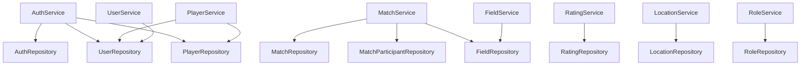

## 3. API dashboard

Базовый адрес по умолчанию: `http://localhost:3000`. Защищённые методы ожидают заголовок `Authorization: Bearer <accessToken>`. Пагинация списков: `page`, `limit` (максимум 100), `sort`, `order=asc|desc`.

Разрешённые поля сортировки:

| Список | `sort` |
|---|---|
| user | `createdAt`, `updatedAt`, `email`, `name`, `city` |
| player | `createdAt`, `updatedAt`, `name`, `level` |
| location | `createdAt`, `updatedAt`, `name`, `city` |
| field | `createdAt`, `updatedAt`, `name`, `format` |
| match | `startsAt`, `createdAt`, `price`, `maxPlayers` |

Легенда доступа:

- **public** — токен не нужен;
- **auth** — валидный access JWT;
- **owner** — текущий пользователь/игрок либо admin;
- **organizer** — организатор матча либо admin;
- **admin** — JWT должен содержать роль `admin`.

### Auth

| Метод и путь | Доступ | Назначение / вход | Ограничение |
|---|---|---|---|
| `POST /api/auth/register` | public | `email`, `password`, `birthDate`; опционально профиль и `createPlayer` | 5 запросов / час / IP |
| `POST /api/auth/login` | public | `email`, `password` → user + access/refresh JWT | 10 / 15 мин / IP и отдельно / email |
| `POST /api/auth/refresh` | public | `refreshToken` → ротация пары токенов | 30 / 15 мин / IP |
| `GET /api/auth/me` | auth | Текущий user и связанный `playerId` | — |
| `POST /api/auth/logout` | auth | Удаляет все refresh-сессии пользователя; опционально blacklist access JWT | — |

### Users и Players

| Метод и путь | Доступ | Назначение / фильтры |
|---|---|---|
| `GET /api/user/list` | admin | Пользователи; `city`, `isActive` + пагинация |
| `GET /api/user/:id` | owner | Получить учётную запись |
| `PUT /api/user/:id` | owner | Обновить учётную запись |
| `DELETE /api/user/:id` | admin | Удалить user; каскадно роли, player получает `userId=null` |
| `GET /api/player/list` | auth | Игроки; `level`, `position`, `status`, `search` + пагинация |
| `GET /api/player/:id` | auth | Игрок + user + вычисленный average/count рейтинга |
| `POST /api/player` | auth | Создать игровой профиль; по умолчанию привязать к caller user |
| `PUT /api/player/:id` | owner | Обновить профиль игрока |
| `DELETE /api/player/:id` | admin | Удалить профиль игрока |

### Locations и Fields

| Метод и путь | Доступ | Назначение / фильтры | Ограничение |
|---|---|---|---|
| `GET /api/location/list` | public | `city`, `country`, `search` + пагинация | 120 / мин / IP |
| `GET /api/location/:id` | public | Локация вместе с полями | — |
| `POST /api/location` | admin | Создать локацию | — |
| `PUT /api/location/:id` | admin | Обновить локацию | — |
| `DELETE /api/location/:id` | admin | Удалить; запрещено, если цепочка содержит матчи | — |
| `GET /api/field/list` | public | `locationId`, `format`, `surface`, `isIndoor` + пагинация | 120 / мин / IP |
| `GET /api/field/:id` | public | Поле вместе с локацией | — |
| `POST /api/field` | admin | Создать поле в существующей локации | — |
| `PUT /api/field/:id` | admin | Обновить поле; `locationId` и `format` не меняются | — |
| `DELETE /api/field/:id` | admin | Удалить; FK запрещает удаление поля с матчами | — |

### Matches и participation ⛔ НЕДОСТОВЕРНО

> **Таблица ниже описывает несуществующие маршруты.** Достоверны только четыре строки, помеченные ✅; строки с ⛔ описывают инвайт-модель, которой в коде нет: маршрутов `/invite` и `/participants/:pid/accept|decline` не существует, параметра `:pid` нет ни в одном пути, `PUT` и `DELETE /api/match/:id` не зарегистрированы. Реальный набор матчевых маршрутов читайте в `src/match/match.routes.ts`. Правка отложена до стабилизации среза `src/match/*`.

| Метод и путь | Доступ | Назначение / правило | Ограничение |
|---|---|---|---|
| ✅ `GET /api/match/list` | public | `city`, `dateFrom`, `dateTo`, `format`, `level`, `status`, `fieldId`, `organizerId` | 60 / мин / IP |
| ✅ `GET /api/match/:id` | public | Матч + field/location + participants/player | — |
| ✅ `POST /api/match` | auth + player | Создать матч; формат обязан совпадать с форматом поля | — |
| ⛔ `PUT /api/match/:id` | organizer | Маршрута нет — изменение матча идёт через `PATCH` | — |
| ⛔ `DELETE /api/match/:id` | organizer | Маршрута нет | — |
| ✅ `GET /api/match/:id/participants` | public | Участники; опционально `status` | — |
| ⛔ `POST /api/match/:id/invite` | organizer | Маршрута нет; приглашений в модели нет | — |
| ⛔ `POST /api/match/:id/join` | auth + player | Маршрут есть, но описание неверно: это не заявка со статусом `REQUESTED`, а самостоятельная запись игрока в лист | — |
| ⛔ `POST /api/match/:id/participants/:pid/accept` | — | Маршрута нет; выборочного одобрения заявки в модели нет | — |
| ⛔ `POST /api/match/:id/participants/:pid/decline` | — | Маршрута нет | — |
| ⛔ `POST /api/match/:id/leave` | auth + player | Маршрут есть, но статуса `LEFT` не существует | — |

### Ratings и Roles

> Модуль `rating` фактически в коде есть, но это **отклонение от решения Р1** (только самооценка, оценок после матча быть не должно) — помечен к удалению, см. [wiki/decisions.md](wiki/decisions.md) и [wiki/PROGRESS.md](wiki/PROGRESS.md).

| Метод и путь | Доступ | Назначение / правило |
|---|---|---|
| `POST /api/rating` | auth + player | Оценка 1–5 после `FINISHED`; оба игрока должны быть CONFIRMED; self-rating запрещён |
| `GET /api/rating/player/:playerId` | public | Средняя оценка, количество и список оценок игрока |
| `GET /api/rating/match/:matchId` | participant/admin | Все оценки матча |
| `DELETE /api/rating/:id` | author/admin | Удалить свою оценку |
| `GET /api/role/list` | admin | Список ролей |
| `POST /api/role` | admin | Создать уникальную роль |
| `DELETE /api/role/:id` | admin | Удалить роль и её назначения |
| `POST /api/role/assign` | admin | Назначить `{userId, roleId}` |
| `POST /api/role/revoke` | admin | Отозвать `{userId, roleId}` |

### Служебные маршруты

| Метод и путь | Доступ | Назначение |
|---|---|---|
| `GET /ping` | public | Простая проверка процесса: `{message: "pong"}` |
| `GET /docs/json` | public | OpenAPI 3.0.3, собранный из route schemas |

### Основной пользовательский сценарий

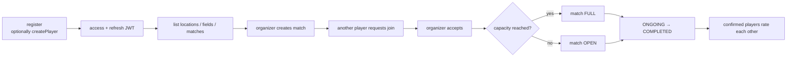

## 4. Таблицы и связи

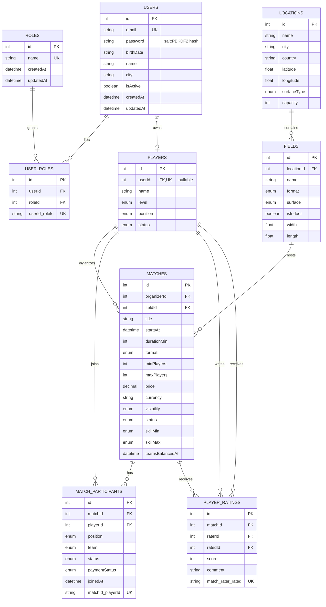

### Кардинальности и удаление

| Родитель → ребёнок | Связь | Поведение при удалении |
|---|---|---|
| users → user_roles | 1:N | `CASCADE` |
| roles → user_roles | 1:N | `CASCADE` |
| users → players | 1:0..1 | `SET NULL` у player |
| locations → fields | 1:N | `CASCADE`, но матчи ниже могут заблокировать цепочку |
| players → matches (organizer) | 1:N | `CASCADE` |
| fields → matches | 1:N | `RESTRICT` |
| matches → match_participants | 1:N | `CASCADE` |
| players → match_participants | 1:N | `CASCADE` |
| matches → player_ratings | 1:N | `CASCADE` |
| players → player_ratings (rater/rated) | 1:N | `CASCADE` |

### Уникальности и важные индексы

- `users.email`, `roles.name`, `players.userId` — unique.
- `user_roles(userId, roleId)` — одна роль назначается пользователю один раз.
- `match_participants(matchId, playerId)` — одна запись игрока на матч.
- `player_ratings(matchId, raterId, ratedId)` — одна оценка конкретного игрока конкретным автором за матч.
- Списки матчей поддержаны индексами по `organizerId`, `fieldId`, `status`, `format`, `skillMin`, `skillMax`, `startsAt` и составным `(status, startsAt)`.
- Для участников есть индексы `playerId` и `(matchId, status, joinedAt)`; для рейтингов — `ratedId`, `raterId`, `matchId`.

### Доменные enum

| Enum | Значения |
|---|---|
| PLAYER_LEVEL | JUNIOR, MIDDLE, SENIOR, LEGEND |
| PLAYER_POSITION | GOALKEEPER, DEFENDER, MIDFIELDER, FORWARD |
| PLAYER_STATUS | ACTIVE, INACTIVE |
| ⛔ MATCH_FORMAT | ~~FIVE_V_FIVE, SEVEN_V_SEVEN, ELEVEN_V_ELEVEN~~ — таких членов нет; фактически `FIVE`, `SEVEN`, `ELEVEN` |
| ⛔ MATCH_STATUS | ~~OPEN, FULL, ONGOING, COMPLETED, CANCELLED~~ — фактически `DRAFT`, `OPEN`, `FULL`, `CONFIRMED`, `IN_PROGRESS`, `FINISHED`, `CANCELLED` |
| ⛔ PARTICIPANT_STATUS | ~~INVITED, REQUESTED, CONFIRMED, DECLINED, LEFT~~ — фактически `REGISTERED`, `WAITLISTED`, `CONFIRMED`, `CHECKED_IN`, `NO_SHOW`, `CANCELLED` |
| ⛔ MATCH_TEAM | ~~TEAM_A, TEAM_B~~ — enum называется `TEAM_SIDE` со значениями `A`, `B` |
| SURFACE_TYPE | NATURAL_GRASS, ARTIFICIAL_GRASS, FUTSAL, CONCRETE, DIRT |

Строки с ⛔ выправлены по `src/constants/enums.ts` — при расхождении с любым другим местом этого документа прав файл enum-ов, а не документ.

## 5. Runtime tracing: ключевые потоки

### Кешируемое чтение

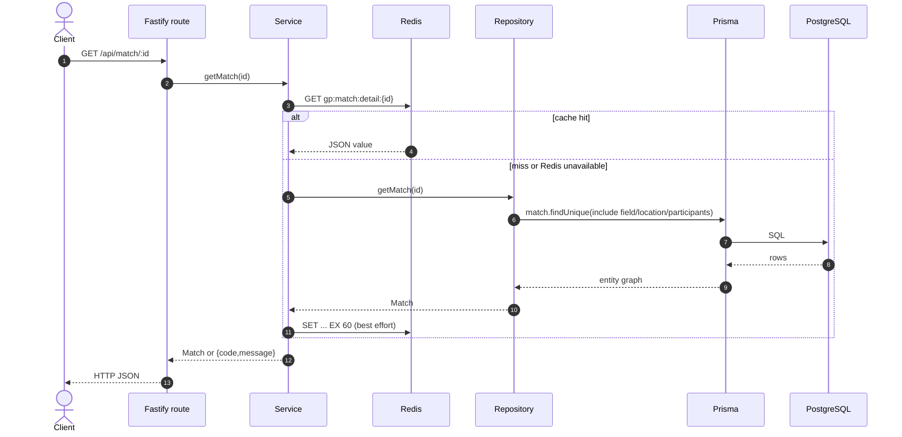

### Login и refresh rotation

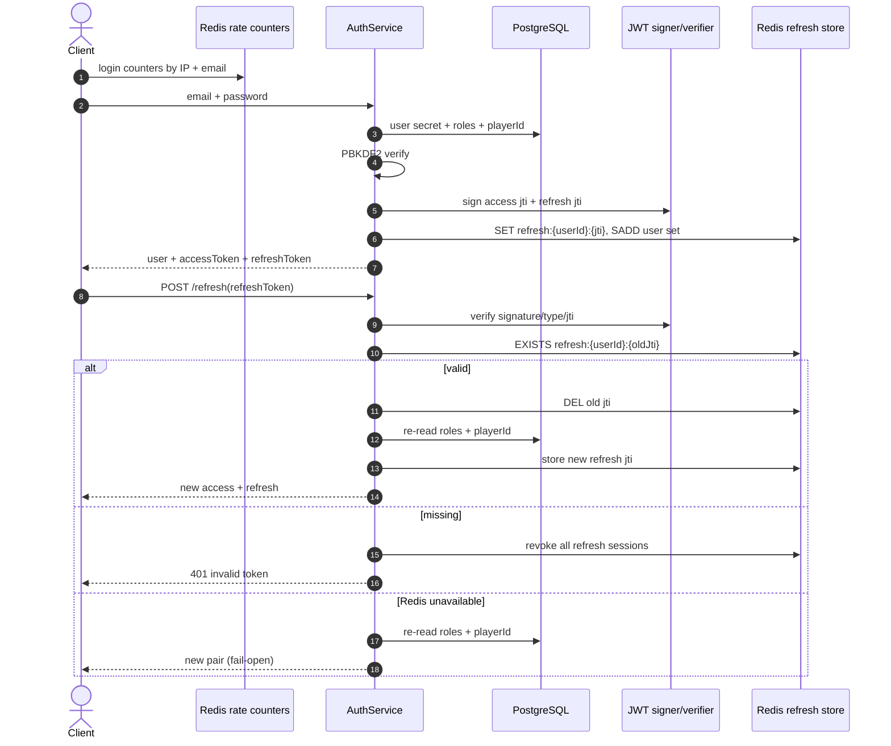

### Подтверждение участника и заполнение матча ⛔ НЕДОСТОВЕРНО

> Диаграмма ниже описывает несуществующий сценарий: маршрута `POST .../participants/:pid/accept` нет, метода `resolveTransition` нет, приглашений и заявок в модели нет. Фактический путь участника — самостоятельный `POST /:id/join` с постановкой в лист и оптовое подтверждение `POST /:id/confirm`. Реальную последовательность читайте в `src/match/match.service.ts` и `src/match/match-participant.repository.ts`.

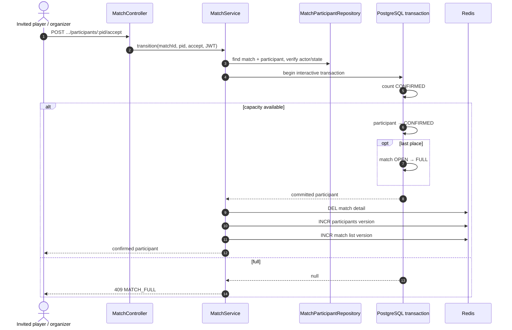

> **Опровергнуто кодом.** Прежнее утверждение — «транзакция не задаёт `isolationLevel: Serializable`, поэтому возможен overbooking при `READ COMMITTED`» — неверно. `src/match/match-participant.repository.ts` пропускает все чувствительные к вместимости транзакции через `runSerializable()`, который задаёт `isolationLevel: Prisma.TransactionIsolationLevel.Serializable` явно и повторяет транзакцию один раз при ошибке сериализации Postgres (`P2034`). Отдельный concurrency-тест по-прежнему полезен, но описанной дыры в изоляции нет.

### Оценка игрока

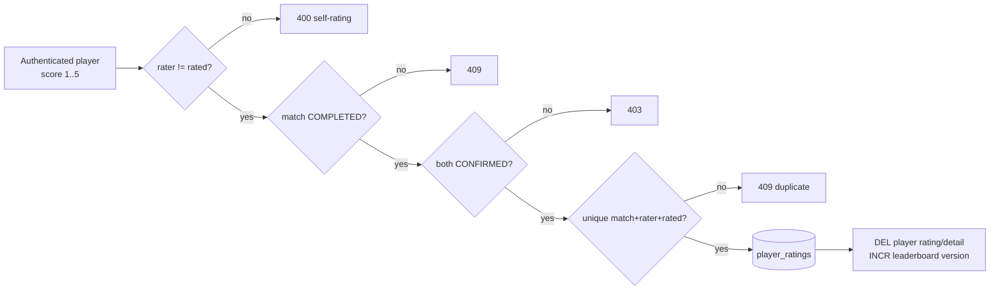

## 6. State machines ⛔ НЕДОСТОВЕРНО

> **Обе диаграммы этого раздела описывают несуществующую модель и подлежат переработке.** Статусов `ONGOING` и `COMPLETED` у матча нет; статусов `INVITED`, `REQUESTED`, `DECLINED`, `LEFT` у участника нет; переходы, доступ и триггеры описаны неверно. Фактические наборы статусов — в шапке документа и в `src/constants/enums.ts`; фактическая матрица переходов матча — в `MATCH_TRANSITIONS` (`src/match/match.service.ts`), фактические переходы участия — в методах `join` / `leave` / `confirm` / `checkIn` того же сервиса. Переработка отложена до стабилизации среза `src/match/*`.

### Матч ⛔ НЕДОСТОВЕРНО

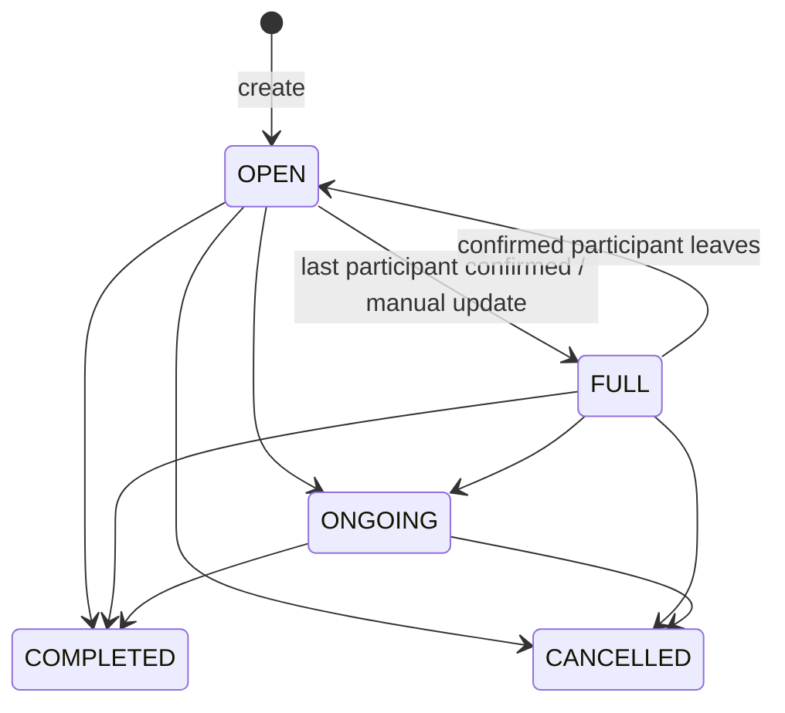

~~`PUT /match/:id` применяет таблицу разрешённых переходов. `DELETE /match/:id` напрямую ставит `CANCELLED`.~~ Ни того, ни другого маршрута нет.

### Участник матча ⛔ НЕДОСТОВЕРНО

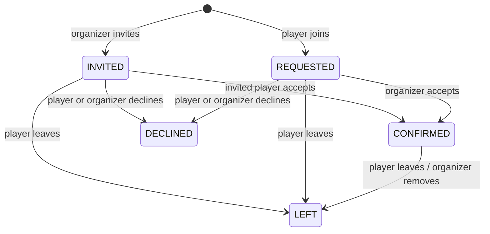

## 7. Cache dashboard

Все физические Redis-ключи автоматически получают prefix `gp:`. При недоступности Redis кеш, rate limits и stateful auth-проверки работают в режиме **fail-open**.

### Read-through cache

| Класс | Физический шаблон после `gp:` | TTL | Читатель | Инвалидация |
|---|---|---:|---|---|
| match list | `match:list:g{version}:{filterHash}` | 30 c | `GET /match/list` | create/update/publish/confirm/cancel; join/leave |
| match detail | `match:detail:{id}` | 60 c | `GET /match/:id` | update/publish/confirm/cancel; любая participation mutation |
| participants | `match:participants:{matchId}:g{version}:{hash}` | 30 c | `GET /match/:id/participants` | join/leave/confirm/check-in |
| field list | `field:list:g{version}:{hash}` | 300 c | `GET /field/list` | field create/update/delete |
| field detail | `field:detail:{id}` | 300 c | `GET /field/:id` | field update/delete |
| location list | `location:list:g{version}:{hash}` | 600 c | `GET /location/list` | location create/update/delete |
| location detail | `location:detail:{id}` | 600 c | `GET /location/:id` | location update/delete; field create/update/delete |
| player list | `player:list:g{version}:{hash}` | 60 c | `GET /player/list` | player create/update/delete |
| player detail | `player:detail:{id}` | 120 c | `GET /player/:id` | player update/delete; rating create/delete |
| player rating | `player:rating:{playerId}` | 300 c | `GET /rating/player/:id` | rating create/delete |
| field schedule | version `ver:field:schedule:{fieldId}` | 60 c declared | **читателя/значений пока нет** | match create/update/cancel bump version |
| leaderboard | version `ver:player:leaderboard` | 300 c declared | **endpoint/значений пока нет** | rating create/delete bump version |

Версионированная инвалидация не удаляет старые list keys: `INCR ver:<class>` мгновенно переключает читателей на новое поколение, а старое поколение исчезает по TTL. Filter hash — первые 16 hex-символов SHA-1 от канонической строки фильтров.

### Auth state и rate limits

| Назначение | Ключ после `gp:` | TTL / поведение |
|---|---|---|
| Активный refresh | `auth:refresh:{userId}:{jti}` | `REFRESH_TOKEN_TTL`, default 30 дней |
| Индекс сессий user | `auth:refresh:user:{userId}` (Set) | default 30 дней; logout удаляет все JTI |
| Access blacklist | `auth:blacklist:{jti}` | оставшееся время access JWT; выключено по умолчанию |
| Rate limit | `rate:{action}:{ip-or-email}` | fixed window конкретного route |

Сбой Redis имеет разные последствия:

- data cache превращается в прямое чтение PostgreSQL;
- rate limits перестают ограничивать запросы;
- access blacklist не применяется;
- login/register продолжают выдавать токены;
- refresh продолжает ротацию без проверки server-side JTI.

## 8. Инфраструктура и системный дизайн

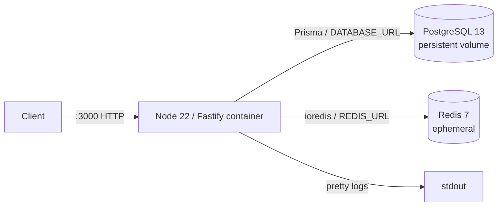

| Среда | Backend | PostgreSQL | Redis | Особенности |
|---|---:|---:|---:|---|
| `docker-compose.dev.yml` | да | да | да | bind mount, watch mode, `HOST=0.0.0.0` |
| `docker-compose.prod.yml` | да | да | да | JWT secret обязателен, Redis без volume |
| `docker-compose.yml` | да | да | нет | `HOST` не задан и Redis default указывает на localhost контейнера |
| `docker-compose.test.yml` | да | да | нет | cache/auth/rate-limit Redis paths работают fail-open |

Сейчас не реализованы: load balancer/reverse proxy, несколько backend replicas, worker/queue, scheduler/cron, object storage/CDN, Telegram integration и managed observability stack. Они упоминаются в старой wiki как целевые элементы, но отсутствуют в runtime-коде.

## 9. Observability и tracing dashboard

### Что есть сейчас

| Сигнал | Реализация | Ограничение |
|---|---|---|
| Logs | Fastify + Pino, `pino-pretty`, стандартный request lifecycle | нет централизованного хранилища, JSON production profile и доменной корреляции |
| Request ID | Fastify создаёт id запроса в своём логгере | id явно не прокидывается в service/repository и внешние зависимости |
| Liveness | `GET /ping` | не проверяет PostgreSQL/Redis, readiness endpoint отсутствует |
| Errors | exact `{code,message}` повышается до соответствующего HTTP status | нет error dashboard/alerting |
| API contract | OpenAPI JSON | Swagger UI не подключён; схемы есть не у всех responses/security |
| Distributed traces | отсутствуют | нет OpenTelemetry SDK, spans, exporter, collector, Jaeger/Tempo |
| Metrics | отсутствуют | нет latency/error/cache/DB pool/business metrics |

### Рекомендуемая трасса одного запроса (целевая, не реализована)

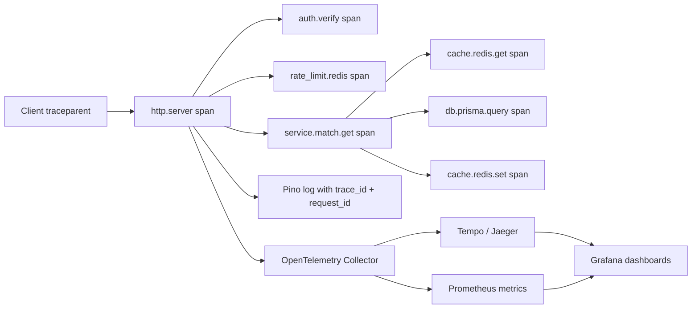

Минимальный будущий набор панелей:

1. HTTP: RPS, p50/p95/p99 latency, 4xx/5xx по route.
2. PostgreSQL: query latency, pool saturation, transaction errors.
3. Redis: hit/miss по cache class, command latency, errors, evictions.
4. Auth: login failures, refresh reuse, blacklist hits, rate-limit rejects.
5. Match domain: created/joined/confirmed/cancelled, capacity conflicts.
6. Trace search: `trace_id`, `request_id`, `user.id`, route, match.id без секретов/JWT.

## 10. Найденные расхождения и риски

| Приоритет | Наблюдение | Практический эффект |
|---|---|---|
| высокий | Миграция `20260712173703_add_match_domain` помечена как ручной черновик и «не применялась» | Код ожидает 5 новых таблиц; состояние реальной БД нужно проверять отдельно |
| ~~высокий~~ снято | ~~Confirm capacity использует transaction без explicit Serializable/lock~~ — **опровергнуто**: `runSerializable()` в `src/match/match-participant.repository.ts` задаёт `Serializable` явно и ретраит `P2034` | Описанного race нет; concurrency-тест остаётся полезным как регресс-защита |
| высокий | Redis security paths fail-open | При outage отключаются rate limit, refresh-state validation и blacklist |
| ~~средний~~ снято | ~~Создаются два PrismaClient: plugin и singleton~~ — **исправлено рефакторингом**: клиент один, живёт в слоте `src/config/prisma.ts`, плагин декорирует его же и закрывает через `closePrisma()` | `server.prisma` и клиент репозиториев — один объект; `onClose` закрывает именно его |
| высокий | Матчевый раздел этого документа (§3 Matches, матчевые enum-ы §4, §5 подтверждение участника, §6 state machines) описывает несуществующую инвайт-модель | Любой, кто пишет по нему код или тесты, делает работу дважды; переработка отложена до стабилизации `src/match/*` |
| средний | Distributed tracing, metrics и readiness отсутствуют | Нет end-to-end диагностики latency/errors и dependency health |
| ~~средний~~ снято | ~~Base/test Compose не содержат Redis; base Compose не задаёт `HOST=0.0.0.0`~~ — **опровергнуто 2026-07-23**: `docker-compose.yml` задаёт `HOST=0.0.0.0` и сервис `redis`, `docker-compose.test.yml` тоже содержит `redis` с healthcheck | — |
| средний | `@fastify/helmet` установлен, но не зарегистрирован | Security headers, описанные в старой wiki, не выдаются приложением |
| ~~средний~~ снято | ~~Используется deprecated package `fastify-jwt`~~ — **опровергнуто 2026-07-23**: в коде `@fastify/jwt@^10.2.0` (`package.json`), импорт в `src/plugins/auth.ts` | — |
| ~~средний~~ снято | ~~Player route schemas передаются не как `{body: ...}`, update schema требует `id` в body~~ — **исправлено**: `player.routes.ts` передаёт `{ schema: { body: ... } }`, `updatePlayerSchema` без `id` | — |
| ~~средний~~ снято | ~~`updateUserSchema.avatar` — number~~ — **исправлено**: `avatar` теперь `Type.Optional(Type.String())` (`src/user/user.model.ts`) | — |
| низкий | `FIELD_SCHEDULE` и `PLAYER_LEADERBOARD` TTL/version classes не имеют читателей | Есть мёртвые/заготовленные cache invalidations |
| ~~низкий~~ обновлено | ~~Старая `docs/wiki` описывает Redis как отсутствующий и перечисляет несуществующие cron/S3/Telegram/feature flags~~ — вика приведена к коду 2026-07-23: Redis описан, нереализованное помечено как целевое | — |

## 11. Где смотреть код

| Область | Файлы |
|---|---|
| Bootstrap и router | `src/index.ts` (только listen), `src/app.ts` (фабрика `buildApp()`), `src/router.ts` |
| Клиенты БД и кеша | `src/config/prisma.ts`, `src/config/redis.ts` — слоты модулей, `getPrisma()`/`getRedis()`, `closePrisma()`/`closeRedis()` |
| Сквозные плагины | `src/plugins/auth.ts`, `prisma.ts`, `redis.ts`, `swagger.ts` — владеют жизненным циклом клиентов |
| **Матчевый домен (источник истины вместо §3/§5/§6)** | `src/constants/enums.ts`, `prisma/schema.prisma`, `src/match/` |
| Доменные слои | `src/<module>/*.routes.ts`, `*.controller.ts`, `*.service.ts`, `*.repository.ts`, `*.model.ts` |
| Cache/rate limit | `src/utils/cache.ts`, `src/utils/rateLimit.ts` |
| Refresh/blacklist | `src/auth/refreshStore.ts` |
| Data model | `prisma/schema.prisma`, `prisma/migrations/` |
| Runtime topology | `Dockerfile`, `docker-compose*.yml` |

## 12. Граница достоверности

**Матчевый раздел документа недостоверен целиком** — см. пометку в шапке; источник истины по матчам: `src/constants/enums.ts`, `prisma/schema.prisma`, `src/match/`. Описание рантайма (фабрика `buildApp()`, единственные клиенты Prisma и Redis в слотах модулей под управлением плагинов) выправлено под текущий код.

Дашборд построен статическим анализом репозитория. Он показывает намерение текущего кода, но не подтверждает, что черновая миграция применена к конкретной БД, Redis доступен в конкретном окружении или маршруты успешно прошли интеграционные тесты. Для operational dashboard следующим шагом нужны реальные OpenTelemetry/metrics-инструментация и подключённый collector.
